# Maintenance Request Classification

## PT-BR

Projeto de classificação supervisionada para **rotear solicitações de manutenção** a partir de texto curto e contexto operacional, inspirado em cenários em que equipes precisam decidir rapidamente qual tipo de intervenção deve ser encaminhado com base em colunas como descrição, localização e status do chamado.

### Base pública utilizada

O projeto usa uma **amostra pública real** do dataset **NYC 311 Service Requests**, acessado pela API aberta da cidade de Nova York.

Fonte:
- [NYC 311 Service Requests](https://catalog.data.gov/dataset/311-service-requests-from-2010-to-present)

O recorte selecionado inclui chamados mais próximos de manutenção urbana e infraestrutura, como:
- `Street Condition`
- `Street Light Condition`
- `Sidewalk Condition`
- `Water System`
- `Sewer`
- `Root/Sewer/Sidewalk Condition`
- `Missed Collection`
- `Damaged Tree`

### Objetivo analítico

O alvo do modelo não é o `complaint_type` original em si, mas um **grupo operacional de manutenção** derivado dele, para simular o roteamento interno de chamados:

- `pavement_surface`
- `pedestrian_infrastructure`
- `lighting`
- `water_network`
- `sanitation`
- `urban_forestry`

Assim, o projeto se aproxima de um problema corporativo real: **dado um texto descritivo e o contexto da ocorrência, prever que tipo de manutenção deve ser acionado**.

### Problema de negócio que o projeto simula

Em ambientes operacionais, centrais de serviço e times de manutenção precisam responder rapidamente perguntas como:

- esse chamado deve ir para pavimentação, iluminação ou saneamento?
- o texto da solicitação já traz informação suficiente para triagem automática?
- quais tipos de manutenção são mais facilmente separáveis a partir da descrição e da localização?

Este projeto transforma essas perguntas em um caso de **classificação supervisionada para roteamento**, em que o modelo aprende padrões linguísticos e contextuais associados a cada grupo de manutenção.

### Variáveis usadas

As features foram montadas a partir de:
- `descriptor`
- `borough`
- `location_type`
- `street_name`
- `agency`
- `status`

Essas colunas são concatenadas em um campo textual único para representar o chamado de forma compacta e próxima da triagem operacional.

### Como o target foi construído

O dataset original traz categorias de solicitação (`complaint_type`) bastante específicas. Para aproximar o problema de um cenário de manutenção com encaminhamento operacional, essas categorias foram agregadas em grupos mais amplos:

- `Street Condition` → `pavement_surface`
- `Sidewalk Condition` → `pedestrian_infrastructure`
- `Street Light Condition` → `lighting`
- `Water System`, `Sewer`, `Root/Sewer/Sidewalk Condition` → `water_network`
- `Missed Collection` → `sanitation`
- `Damaged Tree` → `urban_forestry`

Essa etapa é importante porque substitui um rótulo administrativo detalhado por um rótulo mais próximo da decisão de roteamento que uma equipe de manutenção realmente tomaria.

### Arquitetura do pipeline

```mermaid
flowchart LR
    A["NYC 311 public API"] --> B["CSV sample download"]
    B --> C["pandas preprocessing"]
    C --> D["Feature text assembly"]
    D --> E["Train/test split"]
    E --> F["TF-IDF vectorization"]
    F --> G["Benchmark models"]
    G --> H["Best classifier"]
    H --> I["Predictions + metrics + confusion matrix"]
    I --> J["Streamlit validation app"]
```



### Etapas do pipeline

1. O projeto baixa uma amostra pública filtrada do NYC 311 pela API aberta.
2. Seleciona apenas tipos de ocorrência mais próximos de manutenção e infraestrutura.
3. Constrói o target `maintenance_group`.
4. Concatena colunas descritivas e contextuais em um único campo textual (`feature_text`).
5. Faz `train_test_split` estratificado para preservar a distribuição das classes.
6. Compara três modelos supervisionados baseados em `TF-IDF`.
7. Salva métricas, previsões de validação, matriz de confusão e o melhor pipeline treinado.
8. Expõe tudo em um `Streamlit` para inspeção e simulação de novos chamados.

### Técnicas usadas

- limpeza e preparação tabular com `pandas`
- engenharia de features textuais concatenando descrição e contexto
- vetorização com `TF-IDF`
- classificação supervisionada multiclasse
- comparação entre modelos
- avaliação com `accuracy`, `macro F1` e `weighted F1`
- matriz de confusão para leitura dos erros por classe

### Matemática por trás da abordagem

O pipeline transforma texto em representação numérica com `TF-IDF`, isto é:

- `TF (term frequency)`: mede a frequência de um termo dentro do chamado;
- `IDF (inverse document frequency)`: reduz o peso de termos muito comuns em toda a base;
- `TF-IDF`: destaca termos que são informativos para diferenciar classes.

Depois disso, os classificadores operam sobre vetores esparsos:

- `Logistic Regression`
  Aprende pesos lineares por classe e estima a fronteira de decisão no espaço vetorial.
- `Linear SVC`
  Busca hiperplanos que maximizam a margem entre classes.
- `Multinomial Naive Bayes`
  Assume independência condicional entre termos e usa probabilidades por classe.

Como o problema é multiclasse e relativamente desbalanceado, o uso de `macro F1` é importante porque evita que o desempenho seja julgado apenas pelas classes mais frequentes.

### Resultados atuais

- `11.999` solicitações processadas
- `6` grupos de manutenção
- melhor modelo: `Logistic Regression`
- `Accuracy = 0.9996`
- `Macro F1 = 0.9993`
- `Weighted F1 = 0.9996`

Resumo do benchmark:

```text
model                 accuracy   macro_f1   weighted_f1
logistic_regression   0.999583   0.999302   0.999583
linear_svc            0.999583   0.999302   0.999583
multinomial_nb        0.997917   0.995890   0.997902
```

### Leitura honesta dos resultados

As métricas ficaram muito altas porque o dataset público do NYC 311 traz campos muito informativos para roteamento, especialmente `descriptor`, `agency` e `location_type`. Isso faz deste projeto um ótimo exemplo de **triagem operacional supervisionada**, mas não um benchmark universal de manutenção industrial.

Em outras palavras:

- o projeto é excelente para mostrar classificação de chamados com texto + contexto;
- a métrica não deve ser lida como garantia de generalização para qualquer domínio;
- uma evolução futura interessante seria testar versões mais difíceis, removendo parte dos campos mais explícitos.

### Modelos comparados

- `Logistic Regression`
- `Linear SVC`
- `Multinomial Naive Bayes`

### Por que esses modelos foram escolhidos

- `Logistic Regression`
  É um baseline muito forte para texto vetorizado, simples de interpretar e eficiente.
- `Linear SVC`
  Costuma performar muito bem em classificação de texto com alta dimensionalidade.
- `Multinomial Naive Bayes`
  Serve como baseline probabilístico clássico e rápido para comparação.

Esse trio cria um benchmark bastante sólido para problemas de triagem textual antes de partir para embeddings ou LLMs.

### Bibliotecas e frameworks

- `pandas`
  Para ingestão, limpeza e transformação da base pública.
- `requests`
  Para download reproduzível da amostra via API pública.
- `scikit-learn`
  Para `TF-IDF`, split estratificado, pipelines e classificadores.
- `matplotlib`
  Para salvar a matriz de confusão.
- `streamlit`
  Para o painel interativo.
- `plotly`
  Para gráficos comparativos e exploração da base.

### Artefatos gerados

O projeto salva artefatos úteis para análise e reuso:

- `data/raw/nyc_311_maintenance_sample.csv`
  amostra pública baixada da API
- `data/processed/maintenance_requests_processed.csv`
  base tratada e enriquecida
- `data/processed/model_metrics.csv`
  métricas dos modelos comparados
- `data/processed/validation_predictions.csv`
  previsões da validação
- `data/processed/summary.json`
  resumo geral do pipeline
- `artifacts/best_model.joblib`
  melhor pipeline treinado
- `assets/confusion_matrix.png`
  matriz de confusão do melhor modelo

### Interface

O `Streamlit` foi desenhado para funcionar como uma bancada de validação:
- simular um novo chamado e prever o grupo de manutenção
- comparar métricas dos modelos
- inspecionar a distribuição da base processada


### Estrutura

- [main.py](/Users/flaviagaia/Documents/CV_FLAVIA_CODEX/maintenance-request-classification/main.py)
- [app.py](/Users/flaviagaia/Documents/CV_FLAVIA_CODEX/maintenance-request-classification/app.py)
- [src/data_pipeline.py](/Users/flaviagaia/Documents/CV_FLAVIA_CODEX/maintenance-request-classification/src/data_pipeline.py)
- [src/modeling.py](/Users/flaviagaia/Documents/CV_FLAVIA_CODEX/maintenance-request-classification/src/modeling.py)
- [scripts/download_dataset.py](/Users/flaviagaia/Documents/CV_FLAVIA_CODEX/maintenance-request-classification/scripts/download_dataset.py)

### Como executar

```bash
python3 -m venv .venv
source .venv/bin/activate
pip install -r requirements.txt
python3 main.py
streamlit run app.py
```

### Próximas evoluções possíveis

- retirar colunas mais explícitas para criar um benchmark mais difícil
- adicionar classificação hierárquica (`grupo` → `subtipo`)
- incluir embeddings semânticos para comparar com `TF-IDF`
- testar explainability com palavras mais influentes por classe
- transformar o roteamento em recomendação de equipe/SLA

---

## EN

Supervised classification project for **routing maintenance requests** from short text and operational context, inspired by scenarios where teams need to decide what kind of maintenance action should be triggered based on fields such as description, location, and request status.

### Public dataset

This project uses a **real public sample** from the **NYC 311 Service Requests** dataset, accessed through New York City's open API.

Source:
- [NYC 311 Service Requests](https://catalog.data.gov/dataset/311-service-requests-from-2010-to-present)

The selected subset focuses on urban infrastructure and maintenance-related requests such as:
- `Street Condition`
- `Street Light Condition`
- `Sidewalk Condition`
- `Water System`
- `Sewer`
- `Root/Sewer/Sidewalk Condition`
- `Missed Collection`
- `Damaged Tree`

### Analytical goal

The target is not the original `complaint_type` itself, but an **operational maintenance group** derived from it, in order to simulate internal routing:

- `pavement_surface`
- `pedestrian_infrastructure`
- `lighting`
- `water_network`
- `sanitation`
- `urban_forestry`

This makes the project closer to a real operational routing decision: **given a short request description and its context, predict which maintenance team should handle it**.

### Business problem simulated by the project

In operations and maintenance environments, service centers often need to answer questions such as:

- should this request be routed to pavement, lighting, or sanitation?
- is the textual description enough for automated triage?
- which maintenance categories are easier to separate using text and location context?

This project turns those questions into a **supervised routing classification** problem.

### Features used

The model builds its signal from:
- `descriptor`
- `borough`
- `location_type`
- `street_name`
- `agency`
- `status`

These columns are concatenated into a compact textual representation of the request.

### How the target was built

The original dataset contains detailed `complaint_type` values. To make the problem closer to maintenance routing, those labels were grouped into broader operational classes:

- `Street Condition` → `pavement_surface`
- `Sidewalk Condition` → `pedestrian_infrastructure`
- `Street Light Condition` → `lighting`
- `Water System`, `Sewer`, `Root/Sewer/Sidewalk Condition` → `water_network`
- `Missed Collection` → `sanitation`
- `Damaged Tree` → `urban_forestry`

This step is important because it transforms a detailed administrative category into an operational decision target.

### Pipeline architecture


### Pipeline steps

1. Download a filtered public sample from the NYC 311 open API.
2. Keep only request types that resemble maintenance and infrastructure operations.
3. Build the `maintenance_group` target.
4. Concatenate descriptive and contextual columns into `feature_text`.
5. Apply stratified train/test split.
6. Benchmark three TF-IDF-based classifiers.
7. Save metrics, validation predictions, confusion matrix, and the best trained pipeline.
8. Expose the results in a `Streamlit` app.

### Techniques

- tabular preprocessing with `pandas`
- text feature engineering by concatenating description and context
- `TF-IDF` vectorization
- multiclass supervised classification
- model benchmarking
- evaluation with `accuracy`, `macro F1`, and `weighted F1`
- confusion matrix for error analysis

### Mathematics behind the approach

The pipeline uses `TF-IDF` to convert text into numeric vectors:

- `TF (term frequency)` captures how often a term appears inside a request;
- `IDF (inverse document frequency)` downweights terms that are too common across the dataset;
- `TF-IDF` highlights terms that are more discriminative for routing.

Then the classifiers operate on sparse vector representations:

- `Logistic Regression`
  learns linear weights for each class;
- `Linear SVC`
  learns separating hyperplanes with maximum margin;
- `Multinomial Naive Bayes`
  models class probabilities under conditional independence assumptions.

Because the problem is multiclass and somewhat imbalanced, `macro F1` is especially important to avoid judging performance only by the largest classes.

### Current results

- `11,999` processed requests
- `6` maintenance groups
- best model: `Logistic Regression`
- `Accuracy = 0.9996`
- `Macro F1 = 0.9993`
- `Weighted F1 = 0.9996`

Benchmark summary:

```text
model                 accuracy   macro_f1   weighted_f1
logistic_regression   0.999583   0.999302   0.999583
linear_svc            0.999583   0.999302   0.999583
multinomial_nb        0.997917   0.995890   0.997902
```

### Honest interpretation of the results

The metrics are very high because the public NYC 311 dataset contains highly informative routing signals, especially `descriptor`, `agency`, and `location_type`. This makes the project a strong example of **operational request triage**, but not a universal benchmark for industrial maintenance.

In practice:

- this is a very good demo of text + context classification for maintenance routing;
- the score should not be interpreted as universal performance;
- a useful next step would be to test harder variants with fewer explicit fields.

### Models compared

- `Logistic Regression`
- `Linear SVC`
- `Multinomial Naive Bayes`

### Why these models were chosen

- `Logistic Regression`
  strong, interpretable baseline for sparse text features
- `Linear SVC`
  highly competitive for high-dimensional text classification
- `Multinomial Naive Bayes`
  classic fast probabilistic baseline

Together, they form a solid benchmark before moving to embeddings or LLM-based approaches.

### Libraries and frameworks

- `pandas`
- `requests`
- `scikit-learn`
- `matplotlib`
- `streamlit`
- `plotly`

### Generated artifacts

- `data/raw/nyc_311_maintenance_sample.csv`
- `data/processed/maintenance_requests_processed.csv`
- `data/processed/model_metrics.csv`
- `data/processed/validation_predictions.csv`
- `data/processed/summary.json`
- `artifacts/best_model.joblib`
- `assets/confusion_matrix.png`

### Interface


### Possible next steps

- remove highly explicit fields to create a harder benchmark
- add hierarchical routing (`group` → `subtype`)
- compare `TF-IDF` against embedding-based retrieval/classification
- inspect feature importance or top discriminative terms
- extend routing into SLA or team assignment prediction
